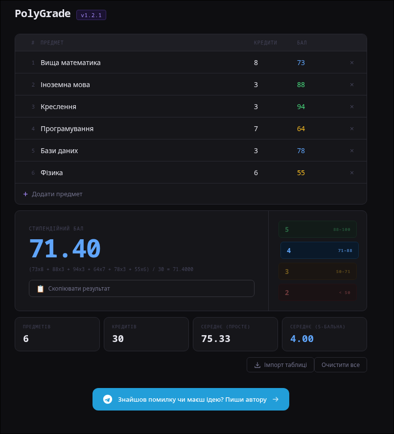

# PolyGrade

> Scholarship score calculator for Lviv Polytechnic National University students.




**[🚀 Live Demo](https://zeonbtw.github.io/PolyGrade/)**

---

## What it does

PolyGrade calculates your **weighted scholarship score** based on subject grades and credit hours — the same formula used by Lviv Polytechnic to determine grant eligibility.

Instead of manually computing a weighted average every semester, you enter your subjects once and get an instant result with grade breakdown.

**Key features:**

- Weighted GPA calculation (score × credits / total credits)
- Grade classification: 5 (88–100) / 4 (71–88) / 3 (50–71) / 2 (< 50)
- **Table import** — copy your curriculum table from the university portal (Ctrl+A → Ctrl+C) and paste it directly into the app
- Simple average and 5-point scale conversion shown alongside the main score
- Copy result to clipboard
- No backend, no login — runs entirely in the browser

---

## Tech stack

| Layer | Technology |
|-------|-----------|
| UI | HTML5, CSS3 (Flexbox) |
| Logic | Vanilla JavaScript |
| PDF parsing | PDF.js (Cloudflare CDN) |
| Hosting | GitHub Pages |

---

## Project structure

```
PolyGrade/
├── index.html       # App markup and layout
├── style.css        # All styles (dark shell, cards, modals, pills)
├── app.js           # Grade calculation logic, table import, UI interactions
└── images/
    └── screenshot.png
```

---

## How to run locally

No build step needed — just open the file:

```bash
git clone https://github.com/Zeonbtw/PolyGrade.git
cd PolyGrade
open index.html   # або просто відкрий у браузері
```

Or use a local server (avoids PDF.js CORS issues):

```bash
python3 -m http.server 8000
# потім відкрий http://localhost:8000
```

---

## How to use

### Manual entry
1. Click **+ Додати предмет**
2. Enter subject name, credit hours, and grade (1–100)
3. Your scholarship score updates in real time

### Table import
1. Open your curriculum page on the university portal
2. Select all (`Ctrl+A`) → Copy (`Ctrl+C`)
3. Click **Імпорт таблиці** in the app and paste

The parser automatically extracts subject names, credits, and grades from the copied table.

---

## Grade scale reference

| National grade | Score range | Scholarship eligibility |
|---------------|-------------|------------------------|
| 5 (Відмінно) | 88 – 100 | ✅ Full grant |
| 4 (Добре) | 71 – 88 | ✅ Standard grant |
| 3 (Задовільно) | 50 – 71 | ❌ No grant |
| 2 (Незадовільно) | < 50 | ❌ No grant |

---

## Author

**Roman Turmenko** — [@zeonbtvv](https://t.me/zeonbtvv) · [GitHub](https://github.com/Zeonbtw) · [LinkedIn](https://linkedin.com/in/roman-turmenko)

Found a bug or have an idea? Open an [issue](https://github.com/Zeonbtw/PolyGrade/issues) or message me on Telegram.

---

## License

MIT
